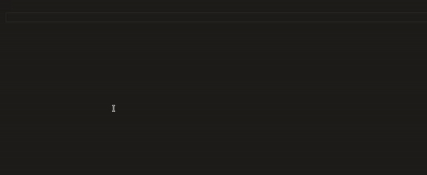

[[**Repository**](https://github.com/fpacenza/dlv2code) | [**Issues**](https://github.com/fpacenza/dlv2code/issues) | [**DLV2**](https://dlv.demacs.unical.it/home)]

# What is this?

This is an extension for Answer Set Programming using the DLV2 system, which combines the grounder [I-DLV](https://dlv.demacs.unical.it/i-dlv) and the solver [WASP](https://dlv.demacs.unical.it/wasp) (but other solvers can be used if specified).  
It supports all ASP constructs, as well as I-DLV specific constructs such as directives, external atoms and annotations (additional informations provided [here](https://github.com/DeMaCS-UNICAL/I-DLV/wiki/)).

# Features

The following features are available once a file with .asp, .lp or .dlv extension is open in the editor.

## Syntax highlighting

## Intellisense

The extension guarantees snippet autocomplete for aggregate functions, directives and external atoms with embedded documentation and hover details.

## Commands for grounding and solving

The extension currently provides three commands for grounding and solving, found under the "ASP > Solving and grounding" submenu:
- **Compute a single Answer Set**  
    Computes and returns one of the possible optimal Answer Sets for the given program
- **Compute all Answer Sets**  
    Computes and returns all of the possible optimal Answer Sets for the given program
- **Compute ground program**  
    Computes and returns the ground instantiation of the given program (does not find the Answer Sets)

## Multifile support

Multiple files can be linked and unlinked to and from each other by using the commands found under the "ASP > Linking" submenu.  
Files that are linked to each other are put in a pool and will be given to the DLV2 system together. The pools are stored in a linkings.json file automatically created in the workspace, and they are merged when files from different pools are linked.  
The following commands are provided:
- **View all pools of linked files**  
    Shows all the pools and the files they contain
- **View the current file's pool of linked files**  
    Shows the pool that contains the file with focus in the editor and all the files it contains
- **Link current file to others**  
    Lets you choose the files that will be linked to the file with focus in the editor
- **Unlink current file from all others**  
    Removes the file with focus in the editor from the pool in which it is contained
- **Disband the current file's pool of linked files**  
    Deletes the pool which contains the file with focus in the editor

## Graphical interface for advanced options

For the more expert users, the extension offers a graphical interface, that can be found in the explorer, in which command line options for the grounder/solver can be inserted. It also allows the use of a custom solver (whose path needs to be specified in the configuration file).

## Configuration file

A configuration file can be quickly accessed through the "Manage configuration file" command found in the "ASP > Other" submenu.  
Currently, this file allows the user to specify the path of a different DLV2 executable to use during computation and the path of a different solver that can be used through the previously mentioned graphical interface.

## Custom external atoms

Custom external atoms can be implemented through Python functions in an external-atoms.py file automatically created in the workspace (if it doesn't exist) through the "Manage custom external atoms" command found in the "ASP > Other" submenu.  
Commented lines before the function definition are considered documentation and interpreted using Markdown syntax. The newly created functions and the associated documentation are then picked up by the intellisense.

Although the extension supports the creation of these external atoms, the default version of the DLV2 system bundled with the extension does not recognize them. An appropriate version of the system can be found [here](https://dlv.demacs.unical.it/home) and, once downloaded, its path must be specified in the configuration file